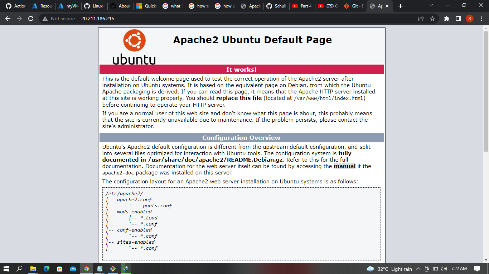

# Lab 1: Create a Linux virtual machine with the Azure CLI

1. Launch Azure Cloud Shell

I lauched Azure cloud Shell on the Azure Platfrom and i was presented with the CLI interface

2. Create a resource group

I created a new resource group with the input

az group create --name JesmykelRG --location Australiaeast

3. Create virtual machine

I created a virtual machine with the input

az vm create --resource-group JesmykelRG --name myVM --image UbuntuLTS --admin-username azureuser --generate-ssh-keys 

I got an output with a public IP address: 20.211.186.215 and a private IP address: 10.0.0.4

4. Open port 80 for web traffic

I opened port 80 for web traffic with the input

az vm open-port --port 80 --resource-group JesmykelRG --name myVM

5. Connect to virtual machine

I connected to vitual machine with public IP address and added the input

ssh azureuser@20.211.186.215

6. Install web server

I installed a web server with the input

sudo apt-get -y update

sudo apt-get -y install apache2

7. View the web server in action

I viewed the web server in action and i got the below image displayed

Notes:
Quickstart: Create a Linux VM

https://docs.microsoft.com/en-us/azure/virtual-machines/linux/quick-create-cli

Quickstart for Bash in Azure Cloud Shell

https://docs.microsoft.com/en-us/azure/cloud-shell/quickstart
