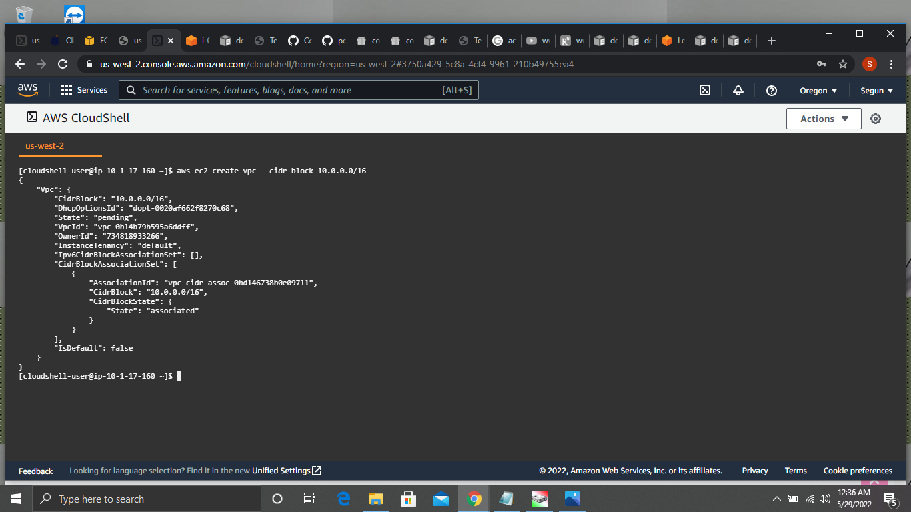

# LAB: Working with Amazon CLI

## Task:

Create a VPC with the following property using the CLI:

1.  Name: LabVPC

To create a vpc i used the code input 

aws ec2 create-vpc --cidr-block 10.0.0.0/16

2.  CIDR block 10.0.0.0/16

Was answered together with task 1.

3.  Two subnets (one private with 10.0.1.0/24 and one public  10.0.0.0/24)

To create a subnet i used the code input

aws ec2 create-subnet 
--vpc-id vpc-0b14b79b595a6ddff 
--cidr-block 10.0.1.0/24
and 
aws ec2 create-subnet 
--vpc-id vpc-0b14b79b595a6ddff 
--cidr-block 10.0.0.0/24

4.   Attach an internet gateway

To attach gateway i firstly created an internet gateway using the code input

aws ec2 create-internet-gateway

I then used the code input below to attach the gateway

aws ec2 attach-internet-gateway 
--vpc-id vpc-0b14b79b595a6ddff 
--internet-gateway-id igw-067b9005311066fd9

To make the subnet 10.0.0.0/24 a public subnet i attached it to the internet gatway by creating a route table using the code input

aws ec2 create-route-table --vpc-id vpc-0b14b79b595a6ddff

I then created a route in the route table using the code input

aws ec2 create-route 
--route-table-id rtb-04db633f665aeee2e 
--destination-cidr-block 0.0.0.0/0 
--gateway-id igw-067b9005311066fd9

I then assigned the subnet to the route i created in the route table using the code input
aws ec2 describe-subnets --filters "Name=vpc-id,Values=vpc-0b14b79b595a6ddff"

After getting the subnet id i then associated with the custom route table using the code input 

aws ec2 associate-route-table  
--subnet-id subnet-0f33fc0a959ad0093 
--route-table-id rtb-04db633f665aeee2e

Thereby making it a public subnet.
Grading tip:  Screenshot each step and upload with your step by step answer

Guide:
https://docs.aws.amazon.com/vpc/latest/userguide/vpc-subnets-commands-example.html

