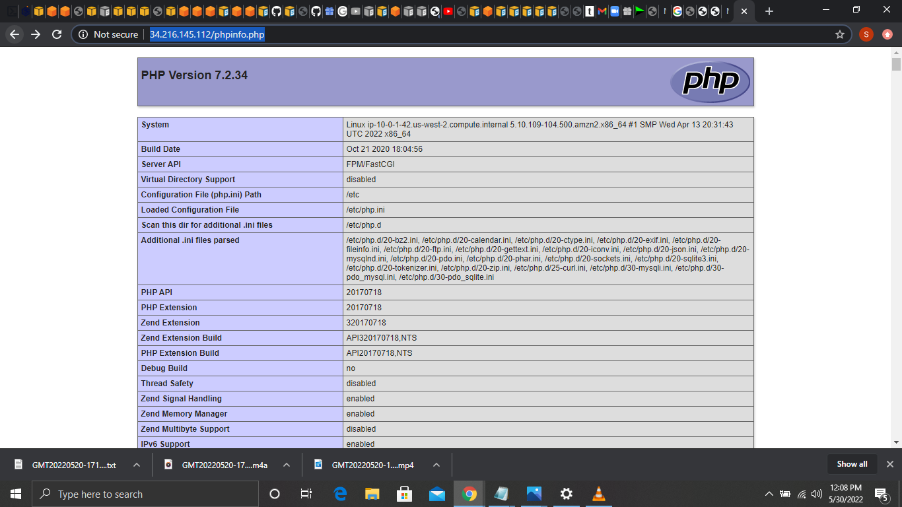

## Install a LAMP web server on Amazon Linux

Tasks:

1. Prepare the LAMP server

sudo yum update -y

sudo amazon-linux-extras install -y lamp-mariadb10.2-php7.2 php7.2

sudo yum install -y httpd mariadb-server

sudo systemctl start httpd

sudo systemctl enable httpd

sudo systemctl is-enabled httpd

sudo usermod -a -G apache ec2-user

exit

groups

sudo chown -R ec2-user:apache /var/www

find /var/www -type f -exec sudo chmod 0664 {} \;

2. Test your LAMP server

echo "<?php phpinfo(); ?>" > /var/www/html/phpinfo.php

http://34.216.145.112/phpinfo.php

3. Secure the database server

sudo systemctl start mariadb

sudo mysql_secure_installation

4. Install phpMyAdmin

sudo yum install php-mbstring php-xml -y

sudo systemctl restart httpd

sudo systemctl restart php-fpm

cd /var/www/html

wget https://www.phpmyadmin.net/downloads/phpMyAdmin-latest-all-languages.tar.gz

mkdir phpMyAdmin && tar -xvzf phpMyAdmin-latest-all-languages.tar.gz -C phpMyAdmin --strip-components 1

rm phpMyAdmin-latest-all-languages.tar.gz

sudo systemctl start mariadb

http://34.216.145.112/phpMyAdmin/

Below are the screenshot of the admin pages displayed

For Apache webserver

For php hompage

For phpmyadmin

Guide: https://docs.aws.amazon.com/AWSEC2/latest/UserGuide/install-LAMP.html

Grading tip:  Screenshot major script outputs and upload with your step by step answer
